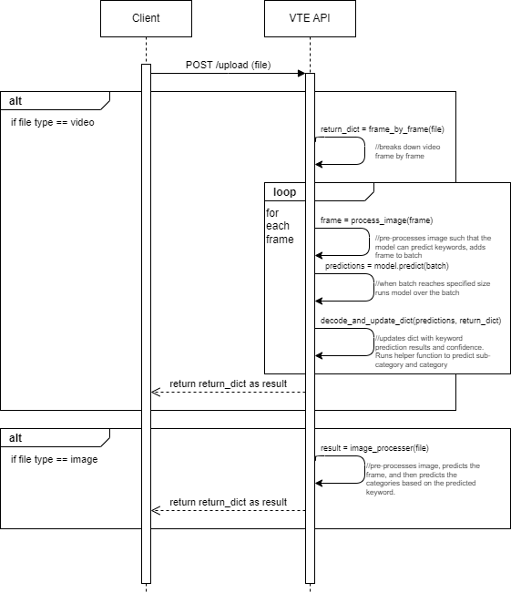

# Video Tagging Engine

This is a standalone application that is developed to take an input as a video or photo, and return the same piece of media with a set of categorzing tags. The application uses FastAPI and TensorFlow 2.

## Setup

You can clone this repository by using ```git clone```

After cloning, install depencies with ```pip install -r requirements.txt```

Then simply start the local server by running ```fastapi run```

**Please note, if you do install and use additional python packages please install pipreqs at the root level of the repo with ```pip install pipreqs``` and then update the requirements file with ```pipreqs . --force```**

## Infrastructure

Currently the app is handling routing through [main.py](./main.py). The existing CI pipeline runs when PRs are opened, but tests and test results can still be viewed by running ```npm test``` locally.

## Routes

### POST, /upload

#### UML Diagram



#### Sample res.result object

| Keyword | Number of Occurences | Sub-Category |  Category | Average Confidence Rating Across Occurences |
|----------|----------|----------|----------|----------|
| object[0]    | object[1]   | object[2] | object[3] | object[4] |
| hammerhead   | 1   | Aquatic Animals | Pets & Animals | 96.2 |


#### Expected Responses

| Status Code | Return | Explanation |
|----------|----------|----------|
| 200    | res.result   | Return with a object containing all related keywords, sub-categories, categories, and confidence metrics.   |
| 415    | HTTPException   | Result of submitting a file type not video or image  |

This route accepts a video and returns a dictionary of keyword occurences found while detecting the objects in the video. It loads the 0.5 model, and iterates over the video frame by frame. There is a working front-end demo that allows you to upload the video and populates a table with the keyword occurences. This isn't the end result, as now we need the keywordEngine to translate these keywords into tags, but we can get a visual representation of how the system will end up looking like. That repository is here: https://github.com/hayat-stikbook/video-engine-fe

Presently this route works by taking the uploaded video, iterating through it, and then collecting every 10th frame. The model adds that frame to the batch and predicts a batch of frames whenever the batch reaches size 32. It then appends the resulting keywords to a dictionary. Each dictionary records a keyword as a key and the value holds the overall count of how many times that keyword appears in the video. After the video finishes processsing, it returns the dictionary. Presently it takes about 0.25 x the length of the video to process, which is down 430% from where we started.

## The Models

### Keyword Model

This is an in progress model that will serve as the endpoint for taking keywords and changing them to tags.

Originally this was an ExpressJS application but the tfjs library was not as easy to use as anticipated. Instead it was chosen to use a python backend so we can integrate tf properly. The model was trained over the dataset extensively as the model only recognizes a finite amount of keywords. As we integrate other methods of getting keywords like TTS, we'll amend this to better perform over unseen keywords.

### Video Model

This model will serve as the initial video processing for videos to transform them into keywords. Presently this model can recognize 1000 distinct objects within videos broken down frame by frame.

- The current in use iteration of the model is the 0.5 model. You can see more detailed documentation of the versions of the videoEngine model [here.](./ml/videoEngineVersionHistory/)