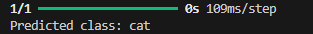

# Video Engine

Here I'll talk a bit more about the iterations of the video engine models.

## (0.1) testModel.keras

This is the original CNN model that was created. It was trained on the CIFAR-10 dataset to recognize the most relevant object in an image out of the 10 defined objects that the model was trained on in the dataset. This is the original, more so a test model to get a handle on image classification. There are two main things that I've recognized this model can be improved on. The model uses multiple layers to process the images, then they are flattened into a 1D vector. The final two layers will allow the model to determine the probability distribution over the ten pre-defined classes that the model will be trained on. The model is then trained, evaluated, and saved. Here is a brief sample of it's work.





- **Data.** The use case for the model that we will end up using is one that will be able to identify a wide variety of object, not just the 10 that this model can do. While a good starting point, from here it would be wise to **re-visit the training strategy** for the next model that is created so we can identify the best way to get it to recognize a much larger scope of objects.

- **Predictions.** A standard CNN only elicits the most dominant object in the frame. In many cases there will be multiple objects in a frame, and the model being able to report on this is crucial. One proposed solution is using a **R-CNN (Region Based Convolutional Neural Network)** which will have an expected outcome of multiple objects if multiple objects are in frame.

You can test this model by running the ```videoEngineTest.py``` file. You can change the sample image and run the script and it will tell you the most relevant object in that image.

## (0.2) testModel0-2.keras

This is the second CNN model that was created. It was trained similarly, but a little more extensively on the same dataset as the 0.1 model. The main difference is that this new model was built differently so that it can recognize multiple objects in an image. There are a couple drawbacks in this model, as this new method of training did drop the accuracy of the model about 10%, but the tradeoff was that it now recognizes multiple objects, as seen in the diagrams further below.

To create the model, the training image set was initially pre-processed and normalized to a specific size. Then, multiple layers are added that builds the architecture of the model that achieve a variety of things, including influencing how it inputs data, reducing complexity, and more. Using a sigmoid activation differs from the 0.1 model and allows us to clasify multiple objects in an image. The model is then compiled, trained for 20 epochs, evaluated, and saved.


- **Data.** The use case for the model that we will end up using is one that will be able to identify a wide variety of objects, not just the 10 that this model can do. While a good starting point, from here it would be wise to **re-visit the training strategy** for the next model that is created so we can identify the best way to get it to recognize a much larger scope of objects.

- **Accuracy.** By using a different training method for finding multiple objects we traded off about 10% of the model's accuracy despite training it for double the epochs. Will have to think of a more optimal solution. 

You can test this model by running the ```videoEngineTest.py``` file. You can change the sample image and run the script and it will tell you the most relevant objects in that image.

## (0.3) YOLO (Potentially Unviable)

0.3 utilized an already existing object detection model (YOLO) with the help of OpenCV to capture the video. The reason this approach is potentially unviable is that the current open source license is ideal for students and hobbyists, but there is a different enterprise license that is for commercial purposes. While the model may be unviable I did go through it, and 0.3 at the current state can process a complete video and let you know of the keywords present. The test I ran on it uses the ```sample.mp4``` file and processes it in real time. The figure below is a screenshot from the model's live test.

/data/sample.png)

- **License.** Although there could be a bit more refinement in getting it to recognize more objects, this is essentially everything we're looking for out of our video engine, which is taking a video, processing it, and coming out with a set of keywords for the keywordEngine to process. It was however mentioned that the solution has to be something that we own, and using the YOLO model requires a commercial license. It's likely this solution won't be pursued for this reason but I think it's good to explore our options and for that reason I'm including this version in the videoEngine repository.

You can test this model by running the ```main.py``` file. You can change the sample mp4 and run the script and it will display the video along with the classes that it's predicting.

## (0.4) testModel0-4.keras

This is the third CNN model that was created. After creating 0.2 I realized that one of the main reasons the accuracy of the model was lower was because the model was only trained over data geared towards a multi-class model when the approach we are taking is a multi-label classification model. To combat this the new model takes a very similar approach to 0.2 but uses a dataset that is built to train multi-label classification models.

To create the model, the training image set was initially pre-processed and normalized to a specific size. Then, multiple layers are added that builds the architecture of the model that achieve a variety of things, including influencing how it inputs data, reducing complexity, and more. Using a sigmoid activation differs from the 0.1 model and allows us to clasify multiple objects in an image. The model is then compiled, trained for 30 epochs, evaluated, and saved.


- **Data.** The use case for the model that we will end up using is one that will be able to identify a wide variety of objects, not just the 10 that this model can do. While a good starting point, from here it would be wise to **re-visit the training strategy** for the next model that is created so we can identify the best way to get it to recognize a much larger scope of objects. After going from 0.2 to 0.4 I was able to realize that there's no special formula in how you build the model to make it perfect, rather it's finding the right data and training the model adequately.

You can test this model by running the ```videoEngineTest.py``` file. You can change the sample image and run the script and it will tell you the most relevant objects in that image.

## (0.5) testModel0-5.keras

This is nearing the last iteration of the models. This one uses a ResNet50 pre-trained model, that was trained on the ImageNet database, the model is completely free to use (commercially as well), and after loading it we can further refine and train it based on our needs. The only concern with this model is that it can be difficult to define thresholds to identify the confidence reading needed to determine if the object is in the frame. Since the model was initially made to be a multi-class classification model that's just how it's built, but in it's current stage we can still assign a theshold and identify relevant items in each frame. In the next iteration we will explore the possbility of refining into more of a native multi-label solution, but if it's not possible we'll proceed with using this model.


You can test this model by running the ```videoEngineTest.py``` file. You can change the sample image and run the script and it will tell you the most relevant objects in that image.

**Post 0.5 research:** It was found that using a multi-label approach tends to skew too much with the accuracy levels. Using a multi-class approach with a defined threshold is yielding more accurate results and will be easier to train the model on moving forward. As of **June 5, 2024**, we'll contine with using the 0.5 model.